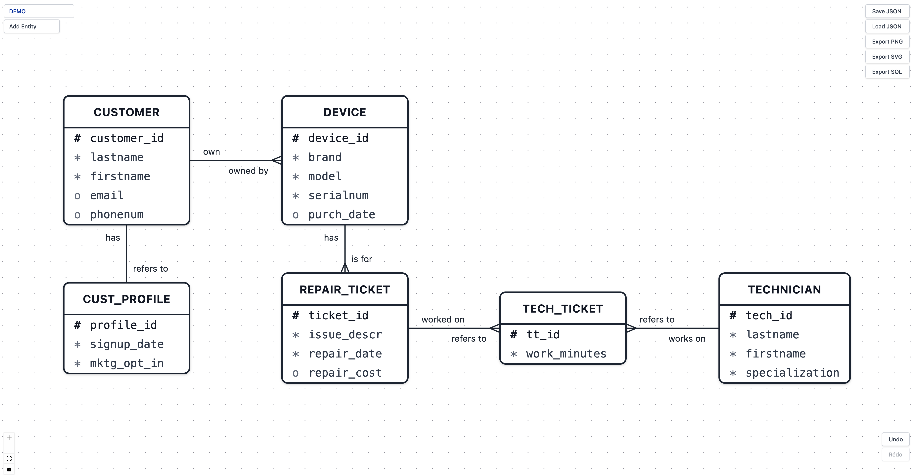

# SparkER

[**A Barker notation ER diagram editor**](https://testing-tree.github.io/CD_002fa7/)

---

## Background

Entity-Relationship (ER) data modeling is a foundational skill in database design. **Barker’s Notation** remains the graphical standard taught across many universities and professional programs—including the Ivey Business School, where this project originated.

The challenge is that mainstream ERD tools, such as Lucidchart, draw.io, dbdiagram.io, and Mermaid, do not fully support the specific visual syntax of Barker’s Notation. This notation requires a unique set of rules: solid and dashed lines to denote mandatory and optional relationships, verb labels at both ends of every relationship, UID bars for weak entity identification, and exclusive relationship arcs. Consequently, students and practitioners are often forced to manually draw these diagrams or struggle with tools not built for the task.

This project bridges that gap. It is a custom-built, web-based visual editor designed from the ground up to generate diagrams that are fully compliant with Barker’s Notation standards.

The tool is officially named **SparkER**, a nod to Entity-Relationship modelling, and to the idea that a single course can spark something that outlasts the semester. The name was suggested by Professor Derrick Neufeld of Ivey Business School.

> During development, the project carried the codename **CD_002fa7**, inspired by International Klein Blue (#002FA7), also the iconic cover color of David Tao’s self-titled debut album (1997). As this represents my first independent project, the choice of color serves both as a personal milestone and a tribute to the artistry of David Tao.

> 项目名称源自国际克莱因蓝 (#002FA7)。它也是音乐人陶喆 (David Tao) 首张个人专辑《陶喆》(1997) 的封面颜色。这同样是我首次尝试独立完成这样的项目，使用此颜色谨作纪念和表示对陶喆音乐创作的喜爱。

---

## Privacy & Data Security

SparkER runs entirely in your browser. No data ever leaves your device.

- No backend server, no database, no cloud storage
- Diagrams are saved only to local files you explicitly export
- No analytics, cookies, tracking, or third-party services
- No outbound network calls of any kind

A Content Security Policy (`connect-src 'none'`) is enforced at the browser level to make this a technical guarantee. 

Click the **Privacy** button in the app for full details and instructions on how to verify this yourself.

---

## Features

### Entities
- Create entity boxes (rounded rectangles, uppercase singular names) via the toolbar
- Add and edit attributes inline; prefix symbols cycle through `#` (identifier), `*` (required), and `o` (optional) on click
- First attribute added to an entity defaults to `#` (identifier); subsequent attributes default to `*` (required)
- While editing an attribute name, press **Enter** to confirm and immediately jump to a new attribute row (the new name is auto-selected, ready to type over); press **Escape** or click away to confirm without adding a new row
- Clear an attribute name entirely, then press **Backspace** again to delete that attribute
- Delete entities and all connected relationships with the Delete key

### Super-entities and Sub-entities
- Select an entity and click **Add Sub-entity** in the Properties panel to create a sub-entity nested inside it
- The super-entity auto-expands to contain its sub-entities; a labeled separator line divides the name/attributes section from the sub-entity area
- Sub-entities inherit a foreign-key-as-primary-key in SQL export, referencing their super-entity
- Deleting a super-entity cascades and removes all its sub-entities and their relationships

### Relationships
- Drag from any of an entity's four connection handles to create a relationship
- Relationships route orthogonally with automatic side selection and **distributed connection points** (multiple lines entering or exiting the same entity side are spread evenly, never stacked)
- Configure per-end properties in the Properties panel: cardinality (one / many), optionality (mandatory / optional), verb label, and UID bar
- Optional ends render as dashed lines; the two halves of a relationship line are styled independently (half-dashed, half-solid)
- Crow's foot symbol on the "many" end; UID bar tick mark for weak entity identification

### Recursive Loops
- Add a recursive relationship to any entity via the **Recursive** button
- The loop renders as a smooth circular arc at one of four corners of the entity; the exit half and entry half are styled independently (dashed / solid) based on their optionality
- Click the corner indicator dots (visible when the loop is selected) to reposition the loop and avoid overlap with other lines
- Drag to create a recursive relationship directly by connecting any handle back to the same entity; the corner is determined automatically from the handles used
- **Recursive m:m**: creates an intersection entity offset from the selected entity and connects it with two 1:m relationships, forming a V-shape for recursive many-to-many scenarios

### Exclusive Relationship Arcs
- Select an entity that has two or more outgoing relationships, then click **Exclusive Arc** in the Properties panel
- A modal lets you select which relationships (≥ 2) are mutually exclusive; confirms with an arc drawn in the SVG overlay
- The arc renders as a quadratic Bézier curve passing through all selected relationship endpoints on the source entity side, with a filled dot at each endpoint
- Click the arc to select it (highlights in blue); the Properties panel shows the arc's source entity and target entities
- Delete a selected arc with the **Delete** key or via the **Delete Arc** button in the Properties panel
- Arcs are automatically cleaned up when a relationship they reference is deleted

### Many-to-Many Relationships
- Direct many-to-many is not allowed in Barker notation; the Properties panel warns when both ends are set to "many"
- Create an intersection entity manually, then connect it with two 1:m relationships

### Properties Panel
- Click any entity, relationship, or arc to open its Properties panel on the right
- **Entity**: shows entity type (entity / super-entity / sub-entity), hierarchy info, and an **Actions** section with context-sensitive operations: Recursive, Recursive m:m, Add Sub-entity, and Exclusive Arc (when eligible)
- **Relationship**: configure cardinality, optionality, verb label, and UID bar for each end independently; many-to-many warning shown inline
- **Arc**: shows source entity and target entity list; Delete Arc button

### Canvas
- Pan and zoom freely; zoom controls in the bottom-left corner
- Snap-to-center alignment guides appear (in #002FA7) when dragging an entity near the horizontal or vertical centre line of another entity
- Undo / Redo with Ctrl+Z / Ctrl+Shift+Z (or Cmd equivalents on macOS)

### Export and Save
- **Save JSON**: download the full diagram as a `.json` file for later editing
- **Load JSON**: restore a previously saved diagram
- **Export PNG**: white-background image cropped tightly to diagram content
- **Export SVG**: scalable vector export, also cropped to content
- **Export SQL**: generate `CREATE TABLE` statements from the diagram, including primary keys, foreign keys, NOT NULL constraints, and composite keys for weak entities

---

## How to Use

### 1. Create your first entity

Click **Add Entity** in the top-left toolbar. A new entity box labelled `ENTITY` appears on the canvas. Double-click the name to rename it (Barker convention: uppercase, singular — e.g. `CUSTOMER`).

### 2. Add attributes

Select the entity, then click **Add Attribute**. A new attribute row appears with the `#` prefix (or `*` if identifiers already exist). Click the prefix symbol to cycle it:

- `#` — identifier (primary key)
- `*` — required (not null)
- `o` — optional (nullable)

Click the attribute name to rename it (Barker convention: lowercase, e.g. `customer_id`). Press **Enter** to confirm and immediately start a new row; press **Escape** or click away to finish without adding another.

### 3. Connect two entities

Hover over an entity to reveal four blue connection handles, one on each side. Drag from any handle to any handle on another entity. A relationship line appears with default settings (1:1 mandatory).

### 4. Configure the relationship

Click the relationship line to select it. The **Properties** panel opens on the right. Set cardinality, optionality, and verb labels for the source end and the target end independently.

Common configurations:

| Scenario | Source end | Target end |
|---|---|---|
| One customer owns many devices | one / mandatory | many / mandatory |
| Customer may optionally have a profile | one / optional | one / mandatory |
| Technician optionally supervises others | one / optional | many / optional |

### 5. Add sub-entities (optional)

Select a super-entity and click **Add Sub-entity** in the Properties panel Actions section. Enter the sub-entity name when prompted. The super-entity box expands automatically and shows a separator line labeled *sub-entities*. Sub-entities can have their own attributes and relationships. In SQL export, the sub-entity receives a foreign-key-as-primary-key column pointing to the super-entity.

### 6. Mark exclusive arcs (optional)

Select an entity that has at least two outgoing relationships, then click **Exclusive Arc** in the Properties panel. A checklist shows all eligible target relationships — tick two or more and click **Add Arc**. A Bézier arc with endpoint dots appears on the canvas. Click the arc to select it; press **Delete** or use the Properties panel to remove it.

### 7. Export

Use the buttons in the top-right corner. For sharing a diagram image, **Export PNG** produces a clean white-background file cropped to your diagram. For database implementation, **Export SQL** generates ready-to-use DDL statements.

---

## Keyboard Shortcuts

| Key | Action |
|---|---|
| `Delete` / `Backspace` | Delete selected entity, relationship, or exclusive arc |
| `Escape` | Deselect all / cancel editing |
| `Ctrl/Cmd + A` | Select all entities |
| `Ctrl/Cmd + Z` | Undo |
| `Ctrl/Cmd + Shift + Z` | Redo |
| `Enter` (while editing attribute name) | Confirm and jump to next new attribute row |
| `Backspace` (on empty attribute name) | Delete the attribute |

---

## Barker Notation Reference

This editor follows the Barker notation specification as described in Ivey Publishing technical note **W38454 "Data Modelling with Barker Notation"** by Derrick Neufeld (2024).

Key rules enforced or supported by this editor:

- Entity names: uppercase, singular
- Attribute names: lowercase
- Every relationship line must have verb labels on both ends
- Mandatory relationships: solid lines; optional relationships: dashed lines
- The "many" end of a relationship shows a crow's foot symbol
- Weak entity identification: UID bar tick mark on the relationship line
- Many-to-many relationships require an intersection entity (direct m:m is flagged as invalid)
- Super-entity / sub-entity hierarchies with visual nesting and FK-as-PK in SQL output
- Exclusive relationship arcs: Bézier arc with endpoint dots indicates mutually exclusive relationship participation

---

## Tech Stack

| Concern | Choice |
|---|---|
| Framework | React 19 with TypeScript |
| Build tool | Vite |
| Styling | Tailwind CSS v4 |
| Canvas / node editor | @xyflow/react v12 (React Flow) |
| State management | Zustand v5 |
| Undo / Redo | zundo |
| Image export | html-to-image |

---

## Design Document

The full design rationale, data schema, component architecture, and phase-by-phase task breakdown are in [`DESIGN.md`](./DESIGN.md).
